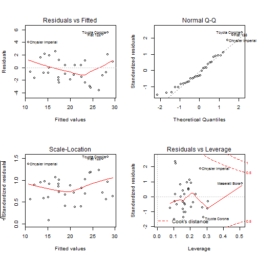

## Data source


```r
data(mtcars)
head(mtcars)
```

```
##                    mpg cyl disp  hp drat    wt  qsec vs am gear carb
## Mazda RX4         21.0   6  160 110 3.90 2.620 16.46  0  1    4    4
## Mazda RX4 Wag     21.0   6  160 110 3.90 2.875 17.02  0  1    4    4
## Datsun 710        22.8   4  108  93 3.85 2.320 18.61  1  1    4    1
## Hornet 4 Drive    21.4   6  258 110 3.08 3.215 19.44  1  0    3    1
## Hornet Sportabout 18.7   8  360 175 3.15 3.440 17.02  0  0    3    2
## Valiant           18.1   6  225 105 2.76 3.460 20.22  1  0    3    1
```


---

## linear regression

```r
lmfit <- lm(mpg ~ cyl+disp+hp+wt+am, data=mtcars)
summary(lmfit)
```

```
## 
## Call:
## lm(formula = mpg ~ cyl + disp + hp + wt + am, data = mtcars)
## 
## Residuals:
##     Min      1Q  Median      3Q     Max 
## -3.5952 -1.5864 -0.7157  1.2821  5.5725 
## 
## Coefficients:
##             Estimate Std. Error t value Pr(>|t|)    
## (Intercept) 38.20280    3.66910  10.412 9.08e-11 ***
## cyl         -1.10638    0.67636  -1.636  0.11393    
## disp         0.01226    0.01171   1.047  0.30472    
## hp          -0.02796    0.01392  -2.008  0.05510 .  
## wt          -3.30262    1.13364  -2.913  0.00726 ** 
## am           1.55649    1.44054   1.080  0.28984    
## ---
## Signif. codes:  0 '***' 0.001 '**' 0.01 '*' 0.05 '.' 0.1 ' ' 1
## 
## Residual standard error: 2.505 on 26 degrees of freedom
## Multiple R-squared:  0.8551,	Adjusted R-squared:  0.8273 
## F-statistic:  30.7 on 5 and 26 DF,  p-value: 4.029e-10
```

---

## Prediction

```r
test <- data.frame(cyl=4,disp=120,hp=110,wt=2.50,am=1)
predict(lmfit, newdata=test)
```

```
##        1 
## 25.47246
```

---

## diagnostic plot

```r
par(mfrow = c(2, 2))
plot(lmfit)
```

 
